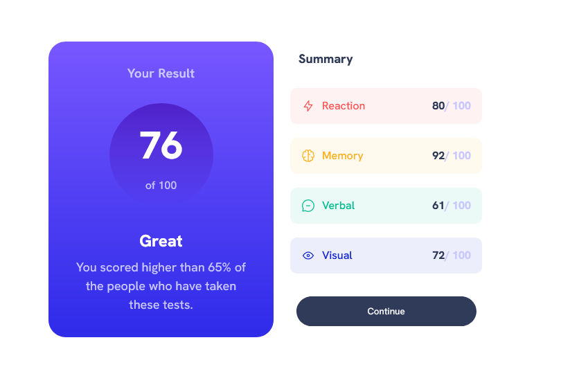

# Frontend Mentor - Results summary component solution

This is a solution to the
[Results summary component challenge on Frontend Mentor](https://www.frontendmentor.io/challenges/results-summary-component-CE_K6s0maV).
Frontend Mentor challenges help you improve your coding skills by building
realistic projects.

## Table of contents

- [Overview](#overview)
  - [The challenge](#the-challenge)
  - [Screenshot](#screenshot)
  - [Links](#links)
- [My process](#my-process)
  - [Built with](#built-with)
  - [What I learned](#what-i-learned)
  - [Continued development](#continued-development)
- [Author](#author)

## Overview

This is a small single component challenge that you can either use a `data.json`
file or hard-code the data. It was a great practice to help with organization of
my CSS. As well as using things I have learned in the past.

### Screenshot

### Links

- Solution URL: [Add solution URL here](https://your-solution-url.com)
- Live Site URL: [Add live site URL here](https://your-live-site-url.com)

## My process

To start off I set-up my HTML -- I tried to think of it as a tree and lay it all
out in that way. Once I did that I added the reusable variables to my CSS file.
I chose for this project to use Vanilla CSS because I feel as if my organization
needs massive work and I had a look at someone elses CSS files and they were
simply stunning, so I am working on making mine the same.

After I had set up the left panel (the purple one), I then used the `data.json`
file provided and used a fetch (plain, no async await, but, I will begin to
refact this and try and make it as clean as possible) and simply populated the
right panel (with the data) and added the HTML I created via a `map()` to the
DOM.

I think went ahead and added my CSS. I began with the mobile view and then added
the media query required for screen sizes above 800px (I used `rem` for the
query.)

### Built with

- CSS custom properties
- Flexbox
- CSS Grid
- Mobile-first workflow
- Vanilla JavaScript
- Vanilla CSS

### What I learned

I learned how to be more organized in my CSS file. This is a place that has
major improvement potential. I also got to practice arrow functions more. As
well as using local `json` data within a `fetch()` - this was something I only
learned a few days ago, it had never occured to me that you could just use local
data and I find it very freaking cool. :)

### Continued development

As always, keeping up with writing and using CSS will help me improve and CSS
and JS as well as writing semantic HTML is always in need of development to be
better. I also would like to come back to this project in a few days and make it
more accessible, it is not now and I **do not** like that.

## Author

- My Portfolio - [Kay Dev](https://www.kaydev.netlify.com)
- Frontend Mentor -
  [@ofthewildfire](https://www.frontendmentor.io/profile/ofthewildfire)
- Twitter - [@im_kfox](https://www.twitter.com/im_kfox)
